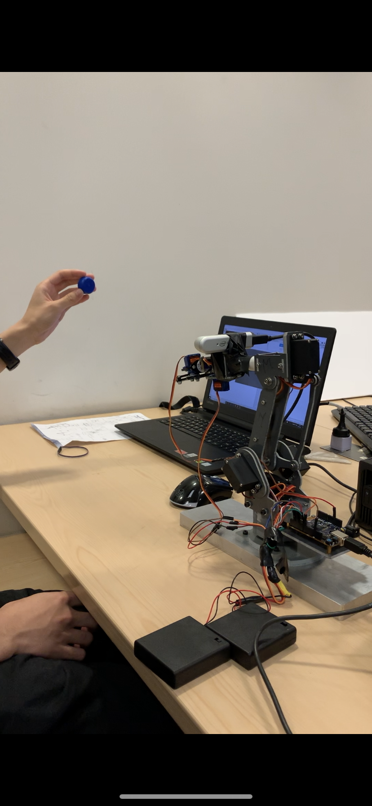

# Imperial College project: Computer vision and Robotic arm 
 
we use the openCV the catch the particular ball or face to guide the Robot 
I didn't transfer the space coordinates to screen cooridinate 
***JUST USE THE DIFFERENCE VALUE*** 
###Intel real sense camera 
provide us the three dimension coordinate 
  
